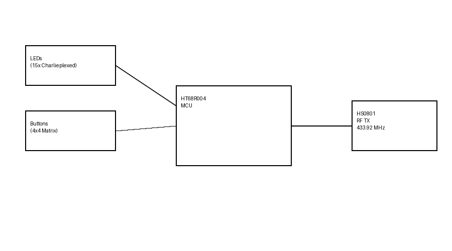
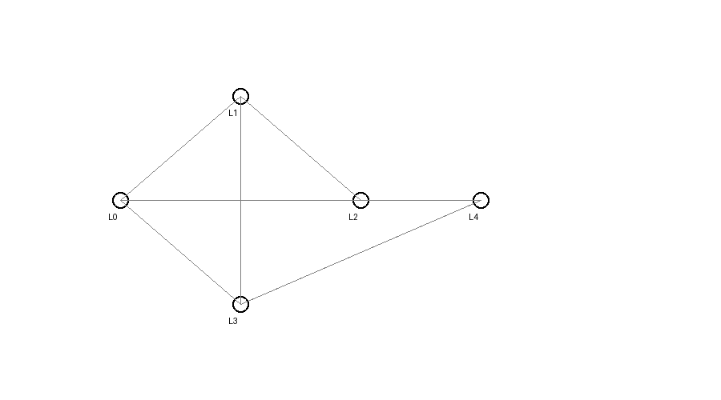

# 📡 433 MHz RF Universal Fan Remote  
**HT68R004 + HS0801 | ASK/OOK | Charlieplexed LEDs**

---

## 🔍 Overview

This project implements a **433.92 MHz RF universal remote controller** for ceiling fans using a **Holtek HT68R004 MCU** and **HS0801 ASK/OOK transmitter**.  
It supports **14 functional buttons**, **15 indicator LEDs (Charlieplexed)**, and a **robust custom RF protocol** designed for reliable reception using low-cost ASK receivers.

---

## ✨ Key Features

✅ Instant button response  
✅ Reliable ASK/OOK RF transmission  
✅ 14 functional buttons  
✅ 15 LEDs using Charlieplexing  
✅ Low power battery operation  
✅ Receiver-side scalable logic  
✅ Long-press & multi-press support  
✅ Remote pairing using address ID  

---

## 🧠 System Architecture

**Transmitter**
- HT68R004 MCU
- HS0801 RF Transmitter
- 433.92 MHz ASK/OOK
- Button matrix + Charlieplexed LEDs

**Receiver**
- RX500 / ASK receiver
- MCU-based decoder
- Stateful command processing

---

## 🔘 Button Functions

| Button | Function |
|------|---------|
| 1 | Power ON / OFF |
| 2 | ECO Mode |
| 3 | Turbo Mode |
| 4–8 | Fan Speed 1–5 |
| 9 | Forward / Reverse |
| 10 | Night Mode |
| 11 | Under-light Toggle |
| 12 | Timer (1h → 3h → 5h → OFF) |
| 13 | Breeze Mode |
| 14 | Remote Pair |

---

## 💡 LED Implementation (Charlieplexing)

- 15 LEDs driven using **5 MCU pins**
- Balanced charlieplexing
- Low GPIO usage
- No external LED drivers required

📷 *Charlieplex wiring diagram:*  
## 💡 LED Implementation (Charlieplexing)

---

## 📡 RF Protocol Summary

- **Frequency:** 433.92 MHz  
- **Modulation:** ASK / OOK  
- **Frame Length:** 32 bits  
- **Structure:**

[ 0xAA ][ 0x0E ][ REMOTE_ID ][ CMD ]

yaml
Copy code

- MSB first
- Frames repeated while button is held

📄 Full protocol details:  
➡ [`docs/RF_Receiver_Implementation_Guide.pdf`](docs/RF_Receiver_Implementation_Guide.pdf)

---

## 🔁 Button Press Logic

- **Single press:** First valid frame after RF silence
- **Hold:** Repeated frames (ignored as new presses)
- **Release:** Detected via RF timeout
- **Multi-press:** Implemented at receiver (Timer)
- **Long-press:** Used for pairing (≥5s)

---

## 📂 Repository Contents

| Folder | Description |
|------|------------|
| `firmware/` | Transmitter & receiver firmware |
| `hardware/` | Schematics & PCB |
| `docs/` | Protocol & receiver documentation |
| `images/` | Photos & diagrams |

---

## 🧪 Project Status

✔ Hardware tested  
✔ RF transmission verified  
✔ RX500 reception verified  
✔ Button matrix stable  
✔ Charlieplex LEDs working  

---

## 🚀 Future Improvements

- CRC/checksum support  
- Bidirectional RF (ACK)  
- Multi-remote pairing  
- Ultra-low power sleep modes  

---

## 👤 Author

**Akshat Gupta**  
Embedded RF Systems Engineer  

---

## 📜 License

MIT License
